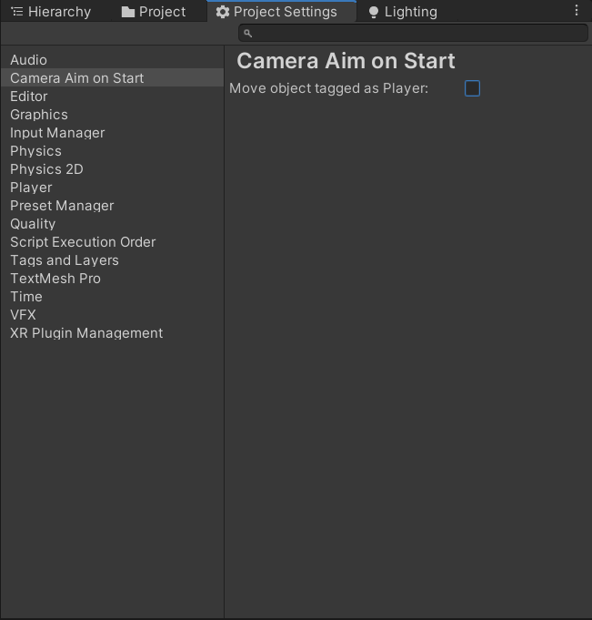

# Change Camera Aim On Start
Ever wanted to start your game from the scene views position instead of the camera position? Look no further!

# Example

# Setup

## Custom
* Install https://github.com/marijnz/unity-toolbar-extender through [github directly into your project](https://docs.unity3d.com/Manual/upm-ui-giturl.html)
* Add `git@github.com:MileyHollenberg/ChangeCameraAimOnStart.git` through the same method as well

## OpenUPM
* Run `openupm add io.megamiley.change-camera-aim-on-start` inside your project folder

# Move your character instead of the camera

If you want to play your game from where you are in the scene view by having your character object be moved to that location you can enable this in your `Project Settings -> Camera Aim on Start` 

Ensure that your player object has the tag `Player` and you should be good to go

# Tested version

This extension has only been tested with 2019.3 so far but should work just fine with 2019.X and 2020.X. If you run into any problems please open an issue.
